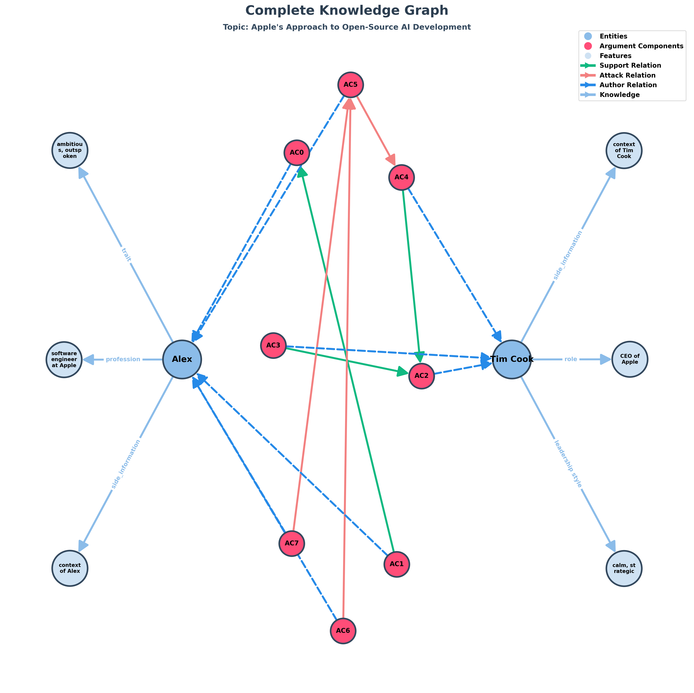
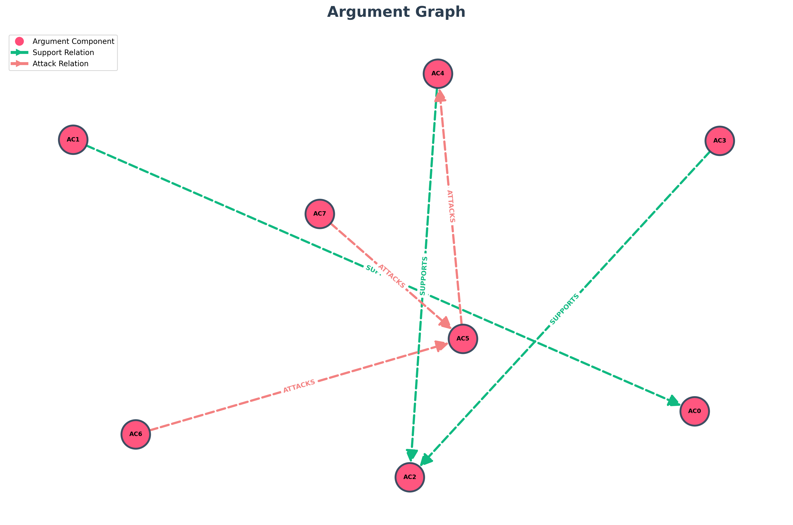

# TESTO
Tim Cook, the CEO of Apple, is known for his calm, strategic leadership style and strong belief in privacy, sustainability, and innovation. He often emphasizes the ethical responsibility of technology companies in shaping society. Alex, a young software engineer at Apple, is ambitious and outspoken. Passionate about open-source development and AI ethics, Alex sometimes challenges corporate policies he feels limit creativity or transparency.
Tim Cook: "Alex, I’ve heard your proposal about making some of our AI frameworks open-source. While I appreciate your enthusiasm, we have to protect our intellectual property and user privacy."
Alex: "I understand, Mr. Cook, but openness can foster innovation. Sharing parts of our AI systems could build trust and attract top developers from the community."
Tim Cook: "True, but once we open that door, we lose control. Our competitors could use our work without sharing anything back. Apple’s strength lies in how we integrate privacy, hardware, and software — that ecosystem needs protection."
Alex: "Still, innovation thrives on collaboration. Transparency doesn’t mean vulnerability; it can show confidence and leadership. Maybe limited openness could strike a balance?"
Tim Cook: *smiling slightly* "That’s a fair point. Perhaps we can explore a controlled release — one that promotes innovation without compromising what makes Apple unique."

## Topic: "Apple's Approach to Open-Source AI Development"

# Entità:
+ Tim Cook
+ Alex

# Knowledge Base Entità finale
[('Alex', 'trait', 'ambitious, outspoken'),

('Alex', 'profession', 'software engineer at Apple'),
 
 ('Tim Cook', 'leadership style', 'calm, strategic'),
 
 ('Tim Cook', 'role', 'CEO of Apple'),
 
 ('Tim Cook',
  'side_information',
  'belief privacy, ethical responsibility technology companies in shaping society, belief sustainability, belief innovation'),
 
 ('Alex',
  'side_information',
  'interest open-source development, opposes corporate policies, interest AI ethics')]

# Componenti Argumentative
- 'AC0': 'openness can foster innovation',
- 'AC1': 'Sharing parts of our AI systems could build trust and attract top developers from the community',
- 'AC2': 'once we open that door, we lose control',
- 'AC3': 'Our competitors could use our work without sharing anything back',
- 'AC4': 'Apple’s strength lies in how we integrate privacy, hardware, and software — that ecosystem needs protection',
- 'AC5': 'innovation thrives on collaboration',
- 'AC6': 'Transparency doesn’t mean vulnerability; it can show confidence and leadership',
- 'AC7': 'Maybe limited openness could strike a balance'

# Attacchi e Supporti
[('AC6', 'ATTACKS', 'AC5'),
 
 ('AC7', 'ATTACKS', 'AC5'),
 
 ('AC1', 'SUPPORTS', 'AC0'),
 
 ('AC3', 'SUPPORTS', 'AC2'),
 
 ('AC4', 'SUPPORTS', 'AC2'),
 
 ('AC5', 'ATTACKS', 'AC4')]

# Score

| Componente | Testo | Autore | Score con side_information |Score senza side_information| via prompt |
| :---: | :--- | :--- | :---: | :---: | :---: |
| **AC0** | openness can foster innovation | Alex | $0.630898$ | $0.589457$|$0.95$|
| **AC1** | Sharing parts of our AI systems could build trust and attract top developers from the community | Alex | $0.580645$ |$0.636101$ |$0.85$|
| **AC2** | once we open that door, we lose control | Tim Cook | $0.699784$ |$0.657350$|$0.95$|
| **AC3** | Our competitors could use our work without sharing anything back | Tim Cook | $0.385431$ | $0.382702$|$0.95$|
| **AC4** | Apple’s strength lies in how we integrate privacy, hardware, and software — that ecosystem needs protection | Tim Cook | $0.384059$ |$0.396236$ |$0.95$|
| **AC5** | innovation thrives on collaboration | Alex | $0.803919$ | $0.707597$ |$0.85$|
| **AC6** | Transparency doesn’t mean vulnerability; it can show confidence and leadership | Alex | $0.265059$ | $0.417089$|$0.85$|
| **AC7** | Maybe limited openness could strike a balance | Alex | $0.228511$ | 0.227682 |$0.85$|

