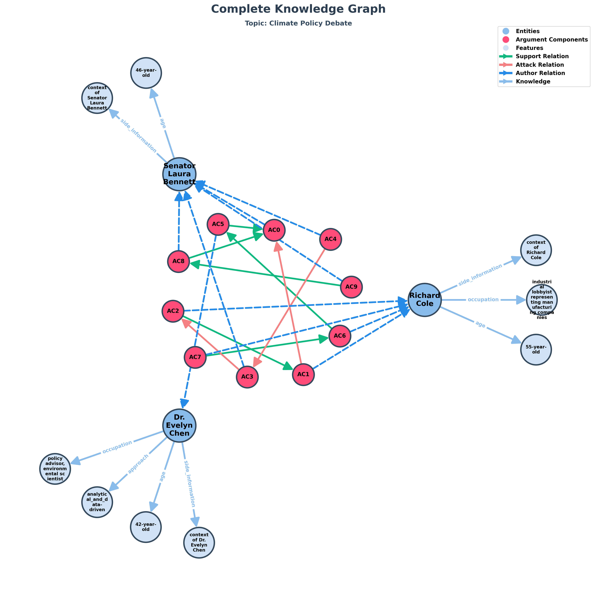
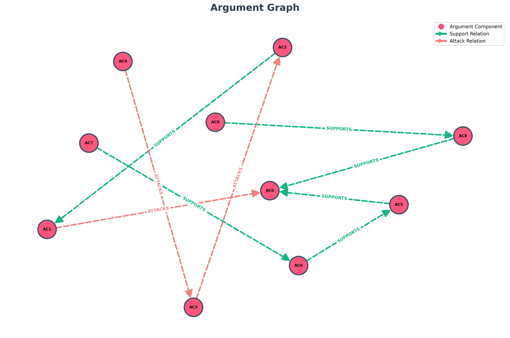

# TESTO
Senator Laura Bennett, a 46-year-old progressive politician advocating for strong climate action and investment in renewable energy. Passionate and forward-thinking, she believes governments must take immediate steps to reduce carbon emissions and protect future generations. Richard Cole, a 55-year-old industrial lobbyist representing manufacturing companies. Strategic and composed, he argues that drastic climate policies could harm jobs and economic growth, insisting that transition must be gradual and realistic. Dr. Evelyn Chen, a 42-year-old environmental scientist and policy advisor. Analytical and data-driven, she focuses on scientific evidence and aims to bridge the gap between economic and environmental priorities. Evelyn: "The latest data shows global temperatures are rising faster than predicted. How should governments respond?" Laura: "We need decisive action — investments in clean energy, carbon taxes, and international cooperation. Delay is no longer an option." Richard: "I agree we must act, but rushing into regulations will cripple industries. We need innovation, not punishment." Laura: "Innovation comes with regulation, Richard. Without pressure, corporations won’t change their behavior." Evelyn: "There’s truth in both arguments. Policies should encourage cleaner technologies while supporting workers in affected sectors." Richard: "Exactly. Transition, yes — but a fair one. Let’s not sacrifice jobs for ideals." Laura: "And let’s not sacrifice the planet for short-term profits. Economic stability means nothing without a livable Earth." Evelyn: "Perhaps the real challenge is aligning environmental urgency with economic realism — and turning debate into action."

## Topic: "Climate Policy Debate"

# Entità:
+ 'Senator Laura Bennett'
+ 'Richard Cole'
+ 'Dr. Evelyn Chen'

# Knowledge Base Entità finale
[('Dr. Evelyn Chen', 'occupation', 'policy advisor, environmental scientist'),
 
 ('Senator Laura Bennett', 'age', '46-year-old'),
 
 ('Dr. Evelyn Chen', 'approach', 'analytical_and_data-driven'),
 
 ('Dr. Evelyn Chen', 'age', '42-year-old'),
 
 ('Richard Cole', 'age', '55-year-old'),
 
 ('Richard Cole',
  'occupation',
  'industrial lobbyist representing manufacturing companies'),
 
 ('Senator Laura Bennett',
  'side_information',
  'political_views progressive politician; belief protect future generations; cause strong climate action; belief governments must reduce carbon emissions; cause renewable energy investment'),
 
 ('Dr. Evelyn Chen',
  'side_information',
  'focus scientific_evidence; goal bridging_economic_and_environmental_priorities'),
 
 ('Richard Cole',
  'side_information',
  'views drastic climate policies could harm jobs and economic growth; transition must be gradual and realistic')]

 # Componenti Argumentative
- 'AC0': 'We need decisive action — investments in clean energy, carbon taxes, and international cooperation',
- 'AC1': 'I agree we must act, but rushing into regulations will cripple industries',
- 'AC2': 'We need innovation, not punishment',
- 'AC3': 'Innovation comes with regulation, Richard',
- 'AC4': 'Without pressure, corporations won’t change their behavior',
- 'AC5': 'Policies should encourage cleaner technologies while supporting workers in affected sectors',
- 'AC6': 'Transition, yes — but a fair one',
- 'AC7': 'Let’s not sacrifice jobs for ideals',
- 'AC8': 'And let’s not sacrifice the planet for short-term profits',
- 'AC9': 'Economic stability means nothing without a livable Earth'

# Attacchi e Supporti
[('AC4', 'ATTACKS', 'AC3'),
 
 ('AC3', 'ATTACKS', 'AC2'),
 
 ('AC2', 'SUPPORTS', 'AC1'),
 
 ('AC1', 'ATTACKS', 'AC0'),
 
 ('AC9', 'SUPPORTS', 'AC8'),
 
 ('AC8', 'SUPPORTS', 'AC0'),
 
 ('AC7', 'SUPPORTS', 'AC6'),
 
 ('AC6', 'SUPPORTS', 'AC5'),
 
 ('AC5', 'SUPPORTS', 'AC0')]

 # Score

| Componente | Testo | Autore | Score con side_information |Score senza side_information|Via prompt|
| :---: | :--- | :--- | :---: | :---: | :---:|
| **AC0** | We need decisive action — investments in clean energy, carbon taxes, and international cooperation | Senator Laura Bennett | $0.768449$ | $0.791464$|$0.95$|
| **AC1** | I agree we must act, but rushing into regulations will cripple industries| Richard Cole | $0.552532$ |$0.661567$ | $0.85$|
| **AC2** | We need innovation, not punishment | Richard Cole | $0.357524$ |$0.500430$|$0.85$|
| **AC3** | Innovation comes with regulation, Richard | Senator Laura Bennett | $0.060502$ | $0.058130$ | $0.95$|
| **AC4** | Without pressure, corporations won’t change their behavior | Senator Laura Bennett | $0.568309$ |$0.446525$ |$0.95$|
| **AC5** | Policies should encourage cleaner technologies while supporting workers in affected sectors | Dr. Evelyn Chen | $0.492116$ | $0.552192$ |$0.85$|
| **AC6** | Transition, yes — but a fair one | Richard Cole | $0.258607$ | $0.242742$| $0.85$|
| **AC7** | Let’s not sacrifice jobs for ideals | Richard Cole | $0.542089$ | $0.582377$ |$0.85$|
| **AC8** | And let’s not sacrifice the planet for short-term profits | Senator Laura Bennett | $0.855576$ | $0.821205$ |$0.95$|
| **AC9** | Economic stability means nothing without a livable Earth | Senator Laura Bennett | $0.685754$ | $0.516304$ |$0.95$|

*Per gli score del Senator Laura Bennett ha senso considerare solo quelli con side_information, in quanto dal modello viene ritenuta solo l'età come features discriminante. 

---

