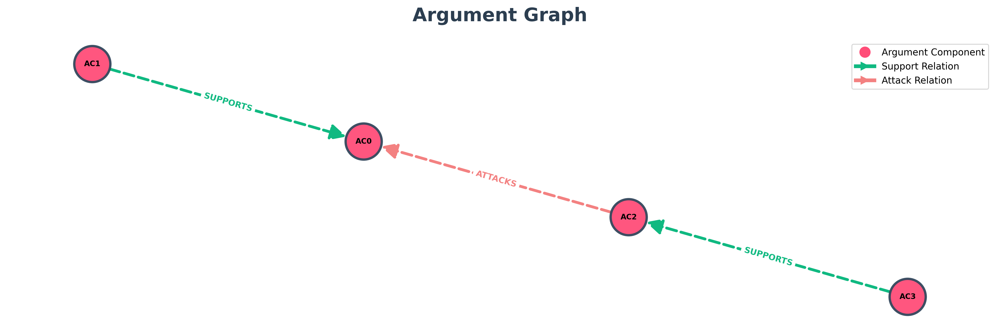

# TESTO
Elena Rossi is an Italian policy advisor who has spent years working with public institutions in Rome to craft digital-governance frameworks. She speaks Italian as her mother tongue and is fluent in English, enabling her to engage in international regulatory discussions. Mark Davis is an American entrepreneur and CEO of an AI start-up based in Silicon Valley. His native language is English, and he occasionally uses Italian when visiting Europe for business. He is deeply immersed in the innovation side of artificial intelligence and its commercial implications. Elena Rossi: "Governments must set clear safety and transparency standards quickly. Italy and the EU are moving from principles to concrete rules — we need enforceable obligations to protect citizens and fundamental rights." Mark Davis: "I agree safety matters, but regulation must avoid stifling innovation. Heavy-handed rules could slow startups and delay useful AI products. Flexible sandboxes and cooperation are better approaches." Elena Rossi: "Collaboration is valuable, but voluntary measures haven’t prevented harms. We need accountability, incident reporting, and real oversight for high-risk systems." Mark Davis: "Then let’s design targeted, risk-based rules that protect people without blocking progress — plus faster government support for compute and infrastructure to keep innovation at home." Elena Rossi: "Balance is crucial — strong rights protections and clear enforcement will build public trust, while still leaving room for innovation."

## Topic: "Digital-Governance Frameworks and AI Regulation"

# Entità:
+ 'Elena Rossi'
+ 'Mark Davis'

# Knowledge Base Entità finale
[('Mark Davis', 'position', 'CEO'),
 
 ('Mark Davis', 'language', 'Italian (occasional use), English (native)'),
 
 ('Elena Rossi', 'language', 'English (fluent), Italian (mother tongue)'),
 
 ('Elena Rossi', 'nationality', 'Italian'),
 
 ('Mark Davis', 'nationality', 'American'),
 
 ('Elena Rossi', 'location', 'Rome'),
 
 ('Elena Rossi', 'occupation', 'policy advisor'),
 
 ('Mark Davis', 'location', 'Silicon Valley'),
 
 ('Mark Davis', 'occupation', 'entrepreneur'),
 
 ('Mark Davis',
  'side_information',
  'company AI start-up based in Silicon Valley; interest innovation in artificial intelligence; commercial_interest commercial implications of artificial intelligence'),
 
 ('Elena Rossi',
  'side_information',
  'expertise digital-governance frameworks')]

# Componenti Argumentative
- 'AC0': 'voluntary measures haven’t prevented harms',
- 'AC1': 'We need accountability, incident reporting, and real oversight for high-risk systems',
- 'AC2': 'let’s design targeted, risk-based rules that protect people without blocking progress — plus faster government support for compute and infrastructure to keep innovation at home',
- 'AC3': 'strong rights protections and clear enforcement will build public trust, while still leaving room for innovation'

# Attacchi e Supporti
[('AC1', 'SUPPORTS', 'AC0'),
 
 ('AC2', 'ATTACKS', 'AC0'),
 
 ('AC3', 'SUPPORTS', 'AC2')]

# Score

| Componente | Testo | Autore | Score con side_information |Score senza side_information| via prompt |
| :---: | :--- | :--- | :---: | :---: | :---: |
| **AC0** | voluntary measures haven’t prevented harms | Elena Rossi | $0.362873$ | $0.371224$|$0.85$|
| **AC1** | We need accountability, incident reporting, and real oversight for high-risk systems | Elena Rossi | $0.496916$ |$0.536132$ |$0.95$|
| **AC2** | let’s design targeted, risk-based rules that protect people without blocking progress — plus faster government support for compute and infrastructure to keep innovation at home | Mark Davis | $0.406214$ |$0.370559$|$0.85$|
| **AC3** |strong rights protections and clear enforcement will build public trust, while still leaving room for innovation | Elena Rossi | $0.722098$ | $0.713411$| $0.95$|

---

---

