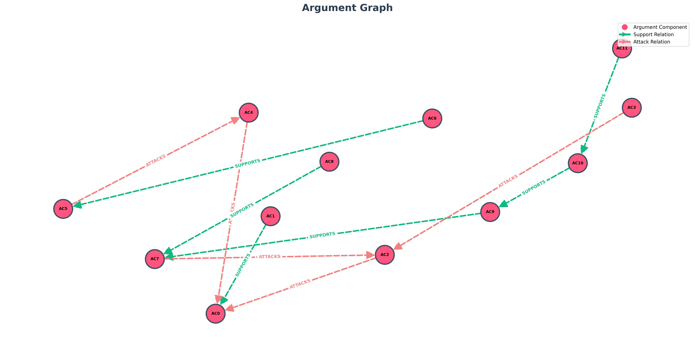

# TESTO
Dr. Elias Rowan is a fictional philosopher of science from Ireland, known for his reflective and sometimes skeptical view of technology’s role in human progress. A university lecturer and writer, he focuses on questions of consciousness, ethics, and the meaning of intelligence. Calm and eloquent, Rowan often reminds his students that technological power without moral understanding can lead to confusion rather than enlightenment. Nova Vega is a fictional tech influencer and AI entrepreneur from Brazil. Charismatic and forward-thinking, she built her reputation by creating online platforms that blend artificial intelligence with education and creative arts. Nova believes that progress and ethics can coexist, as long as innovation remains transparent and accessible to everyone. Her tone is passionate, confident, and optimistic. Rowan: "Ms. Vega, I often wonder whether a machine, no matter how advanced, can truly grasp the weight of a moral choice. Ethics requires empathy, and empathy comes from experience — not algorithms." Nova: "I understand your concern, Doctor. But AI can analyze complex moral scenarios faster and more consistently than humans. If programmed with the right principles, it might even avoid our emotional biases." Rowan: "Yet bias is also what makes us human. Our emotions guide compassion and justice. A machine that only calculates right and wrong risks missing the soul behind the decision." Nova: "But what if we see AI not as a judge, but as an assistant? A system that helps us reflect — not replace us. Morality could become a shared process between human intuition and machine logic." Rowan: "That vision is hopeful, though fragile. The danger lies not in machines themselves, but in people surrendering their responsibility to them." Nova: "Agreed. Technology should amplify our conscience, not erase it. The moment we stop questioning our tools, we stop being their masters."

## Topic: "Technology and Ethics"

# Entità:
+ 'Dr. Elias Rowan'
+ 'Nova Vega'

# Knowledge Base Entità finale
[('Nova Vega', 'occupation', 'fictional tech influencer, AI entrepreneur'),
 
 ('Dr. Elias Rowan', 'nationality', 'Ireland'),
 
 ('Dr. Elias Rowan', 'personality_traits', 'calm_eloquent'),
 
 ('Nova Vega', 'tone', 'passionate_confident_and_optimistic'),
 
 ('Nova Vega', 'origin', 'Brazil'),
 
 ('Nova Vega', 'nationality', 'Brazil'),
 
 ('Nova Vega', 'attitude', 'transparent_and_accessibile_to_everyone'),
 
 ('Dr. Elias Rowan',
  'side_information',
  'view_on_technology reflective_and_skeptical_view_of_technology’s_role_in_human_progress; teaching_style technological_power_without_moral_understanding_can_lead_to_confusion_rather_than_enlightenment; occupation fictional philosopher of science; focus_areas consciousness_ethics_meaning_of_intelligence'),
 
 ('Nova Vega',
  'side_information',
  'reputation_built_by creating online platforms that blend artificial intelligence with education and creative arts; belief progress_and_ethics_can_coexist')]

# Componenti Argumentative
- 'AC0': 'a machine, no matter how advanced, can truly grasp the weight of a moral choice',
- 'AC1': 'Ethics requires empathy, and empathy comes from experience — not algorithms',
- 'AC2': 'But AI can analyze complex moral scenarios faster and more consistently than humans',
- 'AC3': 'If programmed with the right principles, it might even avoid our emotional biases',
- 'AC4': 'bias is also what makes us human',
- 'AC5': 'Our emotions guide compassion and justice',
- 'AC6': 'A machine that only calculates right and wrong risks missing the soul behind the decision',
- 'AC7': 'A system that helps us reflect — not replace us',
- 'AC8': 'Morality could become a shared process between human intuition and machine logic',
- 'AC9': 'The danger lies not in machines themselves, but in people surrendering their responsibility to them',
- 'AC10': 'Technology should amplify our conscience, not erase it',
- 'AC11': 'The moment we stop questioning our tools, we stop being their masters'

# Attacchi e Supporti
[('AC6', 'SUPPORTS', 'AC5'),
 
 ('AC5', 'ATTACKS', 'AC4'),
 
 ('AC1', 'SUPPORTS', 'AC0'),
 
 ('AC3', 'ATTACKS', 'AC2'),
 
 ('AC2', 'ATTACKS', 'AC0'),
 
 ('AC8', 'SUPPORTS', 'AC7'),
 
 ('AC7', 'ATTACKS', 'AC2'),
 
 ('AC4', 'ATTACKS', 'AC0'),
 
 ('AC10', 'SUPPORTS', 'AC9'),
 
 ('AC11', 'SUPPORTS', 'AC10'),
 
 ('AC9', 'SUPPORTS', 'AC7')]

# Score

| Componente | Testo | Autore | Score con side_information |Score senza side_information| via prompt |
| :---: | :--- | :--- | :---: | :---: | :---: |
| **AC0** | a machine, no matter how advanced, can truly grasp the weight of a moral choice | Dr. Elias Rowan | $0.758720$ | $0.779580$|$0.85$|
| **AC1** | Ethics requires empathy, and empathy comes from experience — not algorithms | Dr. Elias Rowan | $0.579714$ |$0.601188$ |$0.95$|
| **AC2** | But AI can analyze complex moral scenarios faster and more consistently than humans | Nova Vega | $0.628027$ |$0.694563$|$0.85$|
| **AC3** | If programmed with the right principles, it might even avoid our emotional biases | Nova Vega | $0.226322$ | $0.271924$|$0.85$|
| **AC4** | bias is also what makes us human | Dr. Elias Rowan | $0.692234$ |$0.562106$ |$0.95$|
| **AC5** | Our emotions guide compassion and justice | Dr. Elias Rowan | $0.056683$ | $0.036100$ |$0.95$|
| **AC6** | A machine that only calculates right and wrong risks missing the soul behind the decision | Dr. Elias Rowan | $0.513741$ | $0.365646$* |$0.85$|
| **AC7** | A system that helps us reflect — not replace us | Nova Vega | $0.247397$ | 0.293199 |$0.95$|
| **AC8** | Morality could become a shared process between human intuition and machine logic | Nova Vega | $0.499885$ | 0.529711 |$0.85$|
| **AC9** | The danger lies not in machines themselves, but in people surrendering their responsibility to them | Dr. Elias Rowan | $0.741856$ | 0.733897 |$0.95$|
| **AC10** | Technology should amplify our conscience, not erase it | Nova Vega | $0.459938$ | 0.550794 |$0.95$|
| **AC11** | The moment we stop questioning our tools, we stop being their masters | Nova Vega | $0.802576$ | 0.834544 |$0.95$|

*Nel side information viene riportato 

('Dr. Elias Rowan',
  'side_information',
  'view_on_technology reflective_and_skeptical_view_of_technology’s_role_in_human_progress; teaching_style technological_power_without_moral_understanding_can_lead_to_confusion_rather_than_enlightenment; occupation fictional philosopher of science; focus_areas consciousness_ethics_meaning_of_intelligence'),

E questo fa decisamente aumentare lo score, viste le tante parole inerenti con il termine "machine".

---

---

