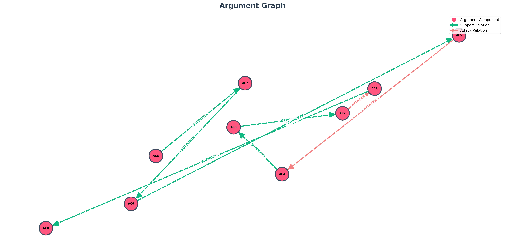

# TESTO
Albert Einstein was a German-born theoretical physicist, best known for developing the theory of relativity. Thoughtful and precise, he approached science as a philosophical search for truth, guided by reason and curiosity. His calm, reflective tone revealed his belief that true discovery demands patience and depth. Lila Moreno is an American science influencer who uses social media to make complex scientific ideas accessible to millions. Energetic and passionate, she believes that modern platforms can inspire curiosity, build global connections, and make science part of everyday conversation. Einstein: "Ms. Moreno, I often wonder if the speed of communication today helps or hinders science. Discovery requires time, reflection, and verification — not haste." Lila: "I understand, Professor. But social media allows scientists to share data instantly, collaborate faster, and reach people who’d never read a research paper. It doesn’t replace the method — it amplifies it." Einstein: "Yet, speed can also spread error. Popularity may overshadow accuracy. How can one protect truth in a world driven by clicks?" Lila: "That’s our biggest challenge. Responsible creators cite sources, highlight uncertainty, and teach critical thinking. The medium isn’t the problem — it’s how we use it." Einstein: "Then perhaps, if social media promotes curiosity and integrity, it can indeed serve science. But we must never forget: the goal is understanding, not attention." Lila: "Agreed. If we combine your rigor with modern reach, we can make science both truthful and inspiring."

## Topic: "Einstein and Lila Moreno on Science Communication in the Digital Age"

# Entità:
+ Albert Einstein
+ Lila Moreno

# Knowledge Base Entità finale
[('Lila Moreno', 'personality', 'energetic and passionate'),
 
 ('Albert Einstein', 'profession', 'theoretical physicist'),
 
 ('Albert Einstein', 'birth_place', 'Germany'),
 
 ('Lila Moreno', 'nationality', 'American'),
 
 ('Albert Einstein', 'personality', 'thoughtful and precise'),
 
 ('Lila Moreno', 'occupation', 'science influencer'),
 
 ('Lila Moreno',
  'side_information',
  'belief modern platforms can inspire curiosity, build global connections, and make science part of everyday conversation; method uses social media; goal make complex scientific ideas accessible to millions'),
 
 ('Albert Einstein',
  'side_information',
  'known_for developing the theory of relativity; scientific_approach philosophical search for truth guided by reason and curiosity')]

# Componenti Argumentative
- 'AC0': 'social media allows scientists to share data instantly, collaborate faster, and reach people who’d never read a research paper',
- 'AC1': 'It doesn’t replace the method — it amplifies it',
- 'AC2': 'speed can also spread error',
- 'AC3': 'Popularity may overshadow accuracy',
- 'AC4': 'How can one protect truth in a world driven by clicks',
- 'AC5': 'Responsible creators cite sources, highlight uncertainty, and teach critical thinking',
- 'AC6': 'The medium isn’t the problem — it’s how we use it',
- 'AC7': 'if social media promotes curiosity and integrity, it can indeed serve science',
- 'AC8': 'If we combine your rigor with modern reach, we can make science both truthful and inspiring'

# Attacchi e Supporti
[('AC4', 'SUPPORTS', 'AC3'),
 
 ('AC3', 'SUPPORTS', 'AC2'),
 
 ('AC2', 'ATTACKS', 'AC1'),
 
 ('AC1', 'SUPPORTS', 'AC0'),
 
 ('AC6', 'SUPPORTS', 'AC5'),
 
 ('AC5', 'ATTACKS', 'AC4'),
 
 ('AC8', 'SUPPORTS', 'AC7'),
 
 ('AC7', 'SUPPORTS', 'AC6')]

# Score

| Componente | Testo | Autore | Score con side_information |Score senza side_information| via prompt |
| :---: | :--- | :--- | :---: | :---: | :---: |
| **AC0** | social media allows scientists to share data instantly, collaborate faster, and reach people who’d never read a research paper | Lila Moreno | $0.802725$ | $0.807283$|$0.95$|
| **AC1** | It doesn’t replace the method — it amplifies it | Lila Moreno | $0.532273$ |$0.537130$ |$0.95$|
| **AC2** | speed can also spread error | Albert Einstein | $0.031223$* |$0.021172$|$0.95$|
| **AC3** | Popularity may overshadow accuracy | Albert Einstein | $0.494676$ | $0.568435$|$0.95$|
| **AC4** | How can one protect truth in a world driven by clicks | Albert Einstein | $0.481455$ |$0.502406$ |$0.85$|
| **AC5** | Responsible creators cite sources, highlight uncertainty, and teach critical thinking | Lila Moreno | $0.560454$ | $0.553249$ |$0.95$|
| **AC6** | The medium isn’t the problem — it’s how we use it | Lila Moreno | $0.859313$ | $0.852018$|$0.95$|
| **AC7** | if social media promotes curiosity and integrity, it can indeed serve science | Albert Einstein | $0.506145$ | 0.541782 |$0.95$|
| **AC8** | If we combine your rigor with modern reach, we can make science both truthful and inspiring | Lila Moreno | $0.480138$ | 0.458963 |$0.95$|

*E' basso considerando il suo contesto.

---

---

