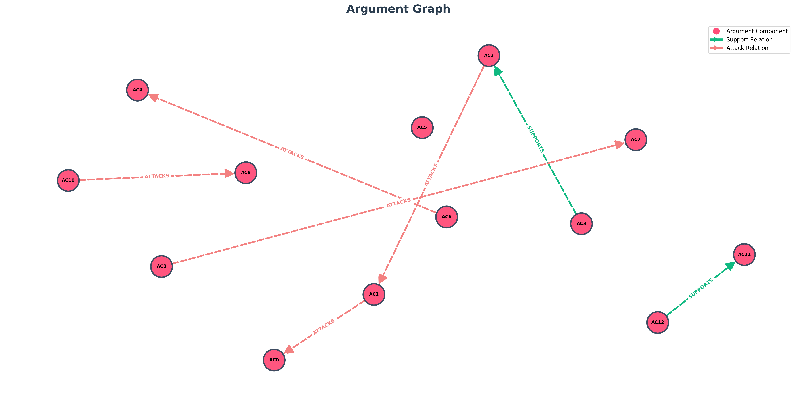

# TESTO
Albert Einstein borns in German, is a theoretical physicist (later Swiss and American citizen). Nobel Laureate (1921). Renowned for the theories of relativity and for his moral voice in public affairs; a pacifist in many respects who nevertheless signed a 1939 letter to President Roosevelt warning of Nazi nuclear efforts and urging research that eventually contributed to the Manhattan Project's inception. J. Robert Oppenheimer, is a American theoretical physicist and scientific director of the Los Alamos Laboratory during the Manhattan Project. A brilliant organizer of scientists and a complex thinker on ethics and policy; widely associated with the development of the first atomic bombs and later involved in debates over nuclear weapons policy and control. Einstein: "Robert, the power we've unlocked is unlike any tool the world has seen. I urged attention to uranium out of fear of fascist misuse — not because I wished to see a weapon of such devastation realized. My deepest worry is that political ends will swallow scientific caution." Oppenheimer: "Albert, in 1942 we faced an enemy that would not hesitate. For many of us, the choice was between allowing a tyrant to gain the bomb or building it first. The laboratory's work was terrible and necessary in that context. But necessity does not erase moral consequence." Einstein: "Necessity in war is argued by many, yet the scale of suffering changes the calculus. We must create institutions to prevent this technology from becoming the norm of political life. International oversight, transparency, disarmament — these are not idealistic fantasies but urgent requirements." Oppenheimer: "I agreed to lead because the scientists could not in good conscience remain idle. After the war, I argued for controls and warned against an unchecked arms race. Still, I recognize a tension: deterrence may have prevented wars between great powers, but it also institutionalizes existential risk." Einstein: "Then our responsibility as scientists is clear: insist on political solutions, educate the public, and refuse to let secrecy and national pride dictate the future of humanity. Science brings power; morality must shape its limits." Oppenheimer: "I concur that scientists must speak truth to power — and also accept that policy requires wisdom beyond the laboratory. If we failed to guide statesmen toward restraint, we have failed as citizens of the world. Let this be a call to build institutions that reduce fear and mistrust, for without them the specter of annihilation remains."

## Topic: "Einstein and Oppenheimer on the Moral Implications of Nuclear Physics"

# Entità:
+ 'Albert Einstein'
+ 'J. Robert Oppenheimer'

# Knowledge Base Entità finale
[('J. Robert Oppenheimer',
  'position',
  'scientific director of the Los Alamos Laboratory during the Manhattan Project'),
 
 ('J. Robert Oppenheimer', 'skill', 'brilliant organizer of scientists'),
 
 ('J. Robert Oppenheimer', 'occupation', 'theoretical physicist'),
 
 ('Albert Einstein', 'citizenship', 'Swiss and American'),
 
 ('Albert Einstein',
  'field_of_renown',
  'theories of relativity and moral voice in public affairs'),
 
 ('Albert Einstein', 'birth_place', 'German'),
 
 ('J. Robert Oppenheimer', 'nationality', 'American'),
 
 ('Albert Einstein', 'award', 'Nobel Laureate (1921)'),
 
 ('J. Robert Oppenheimer',
  'side_information',
  'association development of the first atomic bombs; involvement debates over nuclear weapons policy and control; thinking complex thinker on ethics and policy'),
 
 ('Albert Einstein',
  'side_information',
  'action signed a 1939 letter to President Roosevelt warning of Nazi nuclear efforts and urging research')]

 # Componenti Argumentative
 - 'AC0': 'political ends will swallow scientific caution',
- 'AC1': 'the choice was between allowing a tyrant to gain the bomb or building it first',
- 'AC2': "The laboratory's work was terrible and necessary in that context",
- 'AC3': 'necessity does not erase moral consequence',
- 'AC4': 'Necessity in war is argued by many, yet the scale of suffering changes the calculus',
- 'AC5': 'We must create institutions to prevent this technology from becoming the norm of political life',
- 'AC6': 'International oversight, transparency, disarmament — these are not idealistic fantasies but urgent requirements',
- 'AC7': 'the scientists could not in good conscience remain idle',
- 'AC8': 'deterrence may have prevented wars between great powers, but it also institutionalizes existential risk',
- 'AC9': 'our responsibility as scientists is clear: insist on political solutions, educate the public, and refuse to let secrecy and national pride dictate the future of humanity',
- 'AC10': 'scientists must speak truth to power',
- 'AC11': 'policy requires wisdom beyond the laboratory',
- 'AC12': 'If we failed to guide statesmen toward restraint, we have failed as citizens of the world'

# Attacchi e Supporti
[('AC3', 'SUPPORTS', 'AC2'),
 
 ('AC2', 'ATTACKS', 'AC1'),
 
 ('AC1', 'ATTACKS', 'AC0'),
 
 ('AC6', 'ATTACKS', 'AC4'),
 
 ('AC8', 'ATTACKS', 'AC7'),
 
 ('AC10', 'ATTACKS', 'AC9'),
 
 ('AC12', 'SUPPORTS', 'AC11')]

 # Score

| Componente | Testo | Autore | Score con side_information |Score senza side_information|Via prompt|
| :---: | :--- | :--- | :---: | :---: | :---:|
| **AC0** | political ends will swallow scientific caution | Albert Einstein | $0.086519$ | $0.062175$| $0.95$|
| **AC1** | the choice was between allowing a tyrant to gain the bomb or building it first | J. Robert Oppenheimer | $0.728484$ |$0.763528$ | $0.85$|
| **AC2** | The laboratory's work was terrible and necessary in that context | J. Robert Oppenheimer | $0.277108$ |$0.287561$|$0.85$|
| **AC3** | necessity does not erase moral consequence | J. Robert Oppenheimer | $0.277201$ | $0.340523$ | $0.95$|
| **AC4** | Necessity in war is argued by many, yet the scale of suffering changes the calculus | Albert Einstein | $0.640367$ |$0.660028$ |$0.95$|
| **AC5** | We must create institutions to prevent this technology from becoming the norm of political life | Albert Einstein | $0.510878$ | $0.487309$ |$0.95$|
| **AC6** | International oversight, transparency, disarmament — these are not idealistic fantasies but urgent requirements | Albert Einstein | $0.606027$ | $0.632373$| $0.95$|
| **AC7** | the scientists could not in good conscience remain idle | J. Robert Oppenheimer | $0.560758$ | $0.597726$ |$0.95$|
| **AC8** | deterrence may have prevented wars between great powers, but it also institutionalizes existential risk | J. Robert Oppenheimer | $0.652980$ | $0.674302$ |$0.85$|
| **AC9** | our responsibility as scientists is clear: insist on political solutions, educate the public, and refuse to let secrecy and national pride dictate the future of humanity | Albert Einstein | $0.711628$ | $0.719889$ |$0.95$|
| **AC10** | scientists must speak truth to power | J. Robert Oppenheimer | $0.805976$ | $0.792815$ |$0.85$|
| **AC11** | policy requires wisdom beyond the laboratory | J. Robert Oppenheimer | $0.248122$ | $0.152874$ |$0.85$|
| **AC12** | oIf we failed to guide statesmen toward restraint, we have failed as citizens of the world | J. Robert Oppenheimer | $0.535178$ | $0.563971$ |$0.95$|

---

