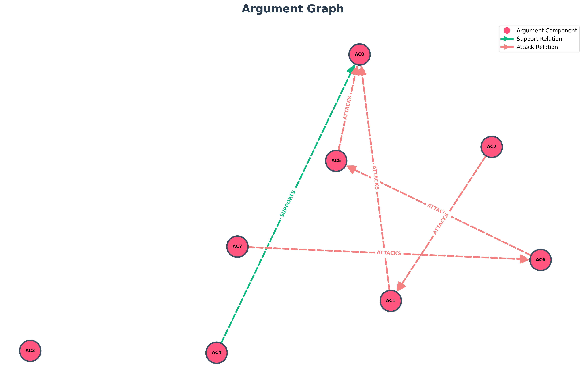

# TESTO
Dr. Emily Carter, a 42-year-old epidemiologist working at a public health institute. She has spent the last decade studying infectious diseases and believes in the importance of vaccines and collective responsibility in preventing pandemics. Calm and analytical, she values data and scientific evidence over opinions.

Mark Reynolds, a 38-year-old small business owner who runs a local gym. During the pandemic, his business suffered due to lockdown restrictions, and he remains skeptical about government-imposed health measures. Outspoken and practical, he prioritizes personal freedom and economic stability.

Emily: "Mark, I understand the lockdowns were tough on small businesses, but they were necessary to prevent hospitals from being overwhelmed."

Mark: "I get that, Emily, but the restrictions destroyed people’s livelihoods. Shouldn’t we have focused on protecting the vulnerable instead of shutting everything down?"

Emily: "That approach sounds reasonable, but without reducing transmission, the virus would have spread uncontrollably. Vaccination and temporary restrictions saved countless lives."

Mark: "Maybe, but the psychological and economic costs were enormous. Governments need to balance health with freedom next time."

Emily: "Agreed — we must learn from this to create smarter, more flexible responses in the future."

## Topic: "Vaccines and Government Health Measures During Pandemics"

# Entità:
+ Dr. Emily Carter
+ Mark Reynolds

# Knowledge Base Entità finale
[('Dr. Emily Carter', 'occupation', 'epidemiologist'),
 
 ('Mark Reynolds', 'business_type', 'local gym'),
 
 ('Mark Reynolds', 'age', '38 years old'),
 
 ('Dr. Emily Carter', 'employer', 'public health institute'),
 
 ('Dr. Emily Carter', 'age', '42 years old'),
 
 ('Dr. Emily Carter', 'personality', 'calm and analytical'),
 
 ('Mark Reynolds', 'personality', 'outspoken and practical'),
 
 ('Mark Reynolds', 'occupation', 'small business owner'),
 
 ('Dr. Emily Carter', 'area_of_study', 'infectious diseases'),
 
 ('Mark Reynolds',
  'side_information',
  'business_status suffered during pandemic; priorities personal freedom, economic stability; attitude_towards_government_measures skeptical'),
 
 ('Dr. Emily Carter',
  'side_information',
  'belief importance of vaccines and collective responsibility; values data and scientific evidence over opinions')]

# Componenti Argumentative
- 'AC0': 'they were necessary to prevent hospitals from being overwhelmed',
- 'AC1': 'the restrictions destroyed people’s livelihoods',
- 'AC2': 'we have focused on protecting the vulnerable instead of shutting everything down',
- 'AC3': 'without reducing transmission, the virus would have spread uncontrollably',
- 'AC4': 'Vaccination and temporary restrictions saved countless lives',
- 'AC5': 'the psychological and economic costs were enormous',
- 'AC6': 'Governments need to balance health with freedom next time',
- 'AC7': 'we must learn from this to create smarter, more flexible responses in the future'

# Attacchi e Supporti
[('AC2', 'ATTACKS', 'AC1'),
 
 ('AC4', 'SUPPORTS', 'AC0'),
 
 ('AC6', 'ATTACKS', 'AC5'),
 
 ('AC5', 'ATTACKS', 'AC0'),
 
 ('AC7', 'ATTACKS', 'AC6'),
 
 ('AC1', 'ATTACKS', 'AC0')]

# Score

| Componente | Testo | Autore | Score con side_information |Score senza side_information| via prompt |
| :---: | :--- | :--- | :---: | :---: | :---: |
| **AC0** | they were necessary to prevent hospitals from being overwhelmed | Dr. Emily Carter | $0.797431$ | $0.819360$|$0.95$|
| **AC1** | the restrictions destroyed people’s livelihoods | Mark Reynolds | $0.269103$ |$0.206480$ |$0.95$|
| **AC2** | we have focused on protecting the vulnerable instead of shutting everything down | Mark Reynolds | $0.657904$ |$0.703055$|$0.35$|
| **AC3** | without reducing transmission, the virus would have spread uncontrollably | Dr. Emily Carter | $0.676517$ | $0.691084$|$0.95$|
| **AC4** | Vaccination and temporary restrictions saved countless lives | Dr. Emily Carter | $0.229898$* |$0.254046$ |$0.95$|
| **AC5** | the psychological and economic costs were enormous | Mark Reynolds | $0.135929$ | $0.099476$ |$0.95$|
| **AC6** | Governments need to balance health with freedom next time | Mark Reynolds | $0.588836$ | $0.585571$|$0.85$|
| **AC7** | we must learn from this to create smarter, more flexible responses in the future | Dr. Emily Carter | $0.718360$ | $0.750579$ |$0.95$|

*Questo dovrebbe essere più alto considerando il contesto di Emily.

---

