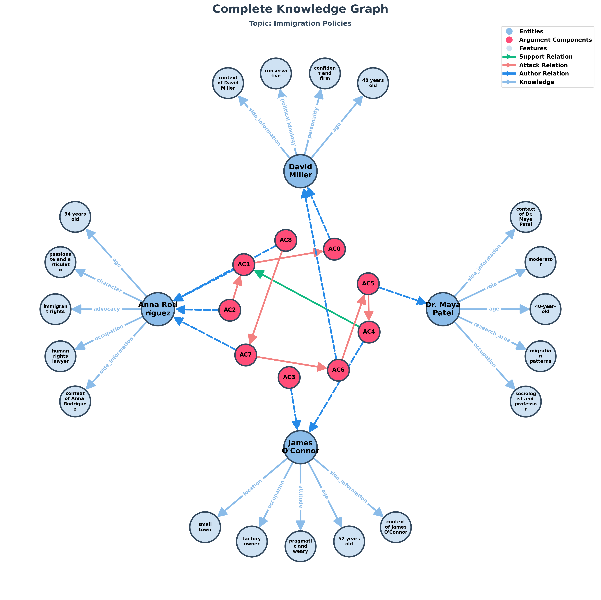
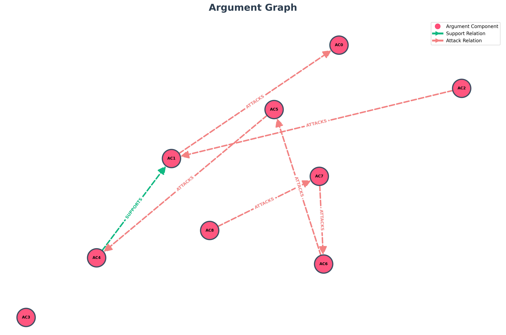

# TESTO
David Miller, a 48-year-old conservative politician who believes in strong border control and prioritizing national security. He argues that immigration policies should protect citizens’ jobs and ensure social stability. Confident and firm, he tends to emphasize order and sovereignty. Anna Rodríguez, a 34-year-old human rights lawyer and immigrant rights advocate. She believes immigration strengthens nations by bringing diversity, innovation, and resilience. Passionate and articulate, she often challenges policies she sees as unjust or discriminatory. James O’Connor, a 52-year-old factory owner from a small town who has seen economic shifts due to globalization. Pragmatic and weary, he focuses on the economic impact of immigration, balancing opportunity with local concerns. Dr. Maya Patel, a 40-year-old sociologist and professor who researches migration patterns. Neutral and analytical, she values data-driven approaches and serves as a moderating voice in the discussion. Maya: "Immigration remains one of the most divisive political issues today. How should countries balance openness with security?" David: "We need to protect our borders. Without control, we risk instability and strain on public resources." Anna: "But immigrants contribute enormously to our economies and culture. Closing doors means closing minds." James: "I’ve seen both sides. Immigrants work hard, but sometimes local workers feel left behind. We need fair policies, not extremes." Maya: "Exactly. The challenge is designing systems that are both humane and sustainable." David: "That sounds good in theory, but in practice, too much openness invites exploitation." Anna: "And too much restriction destroys opportunity and compassion. We can be safe *and* fair." James: "Maybe what we need is transparency — clear rules, faster processes, and support for both newcomers and locals." Maya: "A balanced approach — one that recognizes both the human and economic realities — seems the only path forward."

## Topic: "Immigration Policies"

# Entità:
+ 'David Miller'
+ 'Anna Rodríguez'
+ 'James O'Connor'
+ 'Dr. Maya Patel'

# Knowledge Base Entità finale
[('Dr. Maya Patel', 'occupation', 'sociologist and professor'),
 
 ("James O'Connor", 'location', 'small town'),
 
 ('David Miller', 'age', '48 years old'),
 
 ("James O'Connor", 'occupation', 'factory owner'),
 
 ('Anna Rodríguez', 'age', '34 years old'),
 
 ('Dr. Maya Patel', 'research_area', 'migration patterns'),
 
 ("James O'Connor", 'attitude', 'pragmatic and weary'),
 
 ('David Miller', 'personality', 'confident and firm'),
 
 ("James O'Connor", 'age', '52 years old'),
 
 ('Anna Rodríguez', 'character', 'passionate and articulate'),
 
 ('Dr. Maya Patel', 'age', '40-year-old'),
 
 ('David Miller', 'political ideology', 'conservative'),
 
 ('Anna Rodríguez', 'advocacy', 'immigrant rights'),
 
 ('Dr. Maya Patel', 'role', 'moderator'),
 
 ('Anna Rodríguez', 'occupation', 'human rights lawyer'),
 
 ('Dr. Maya Patel',
  'side_information',
  'methodology data-driven; attitude neutral and analytical'),
 
 ('David Miller',
  'side_information',
  'argument immigration policies should protect citizens’ jobs and ensure social stability; belief strong border control; emphasis order and sovereignty; belief prioritizing national security'),
 
 ("James O'Connor",
  'side_information',
  'balance opportunity with local concerns; focus economic impact of immigration; experience seen economic shifts due to globalization'),
 
 ('Anna Rodríguez',
  'side_information',
  'action challenges policies she sees as unjust or discriminatory; belief immigration strengthens nations by bringing diversity, innovation, and resilience')]

# Componenti Argumentative
- 'AC0': 'Without control, we risk instability and strain on public resources',
- 'AC1': 'immigrants contribute enormously to our economies and culture',
- 'AC2': 'Closing doors means closing minds',
- 'AC3': 'Immigrants work hard, but sometimes local workers feel left behind',
- 'AC4': 'We need fair policies, not extremes',
- 'AC5': 'The challenge is designing systems that are both humane and sustainable',
- 'AC6': 'too much openness invites exploitation',
- 'AC7': 'too much restriction destroys opportunity and compassion',
- 'AC8': 'We can be safe *and* fair'

# Attacchi e Supporti
[('AC8', 'ATTACKS', 'AC7'),
 
 ('AC7', 'ATTACKS', 'AC6'),
 
 ('AC2', 'ATTACKS', 'AC1'),
 
 ('AC4', 'SUPPORTS', 'AC1'),
 
 ('AC6', 'ATTACKS', 'AC5'),
 
 ('AC1', 'ATTACKS', 'AC0'),
 
 ('AC5', 'ATTACKS', 'AC4')]

# Score

| Componente | Testo | Autore | Score con side_information |Score senza side_information|Via prompt|
| :---: | :--- | :--- | :---: | :---: | :---:|
| **AC0** | Without control, we risk instability and strain on public resources | David Miller | $0.671691$ | $0.558352$|$0.95$|
| **AC1** | immigrants contribute enormously to our economies and culture | Anna Rodríguez | $0.523451$ |$0.573196$ | $0.95$|
| **AC2** | Closing doors means closing minds | Anna Rodríguez | $0.533297$ |$0.420362$|$0.95$|
| **AC3** | Immigrants work hard, but sometimes local workers feel left behind | James O'Connor | $0.883257$ | $0.877816$| $0.85$|
| **AC4** | We need fair policies, not extremes | James O'Connor | $0.370426$ |$0.463465$ |$0.85$|
| **AC5** | The challenge is designing systems that are both humane and sustainable | Dr. Maya Patel | $0.614426$ | $0.652579$ |$0.95$|
| **AC6** | too much openness invites exploitation | David Miller | $0.292942$ | $0.257859$| $0.95$|
| **AC7** | too much restriction destroys opportunity and compassion | Anna Rodríguez | $0.297990$ | $0.338916$ |$0.95$|
| **AC8** | We can be safe *and* fair | Anna Rodríguez | $0.237891$ | $0.281155$ |$0.95$|

---

