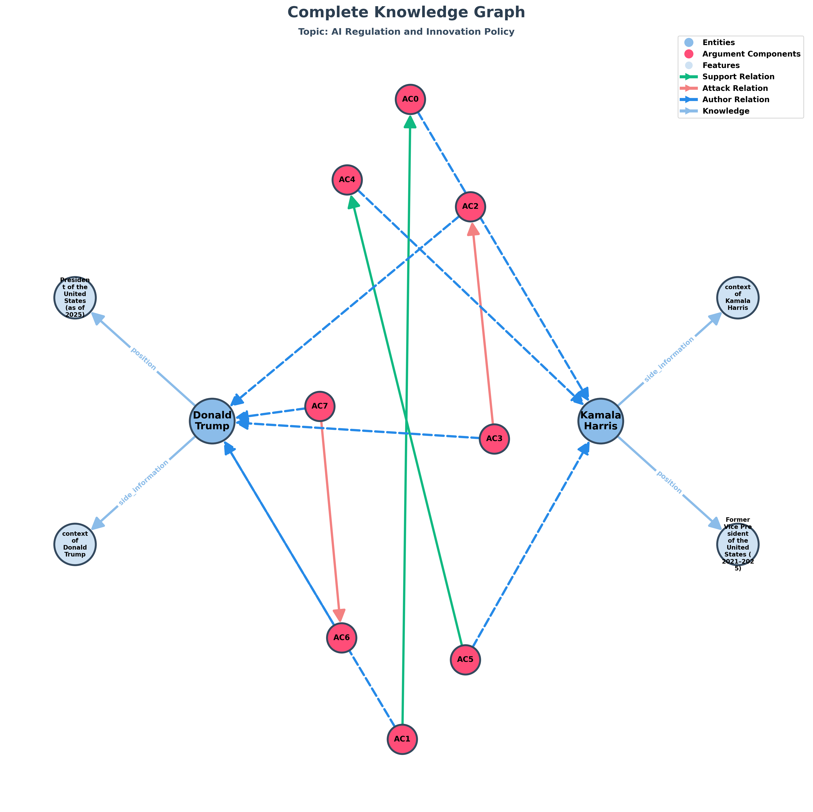
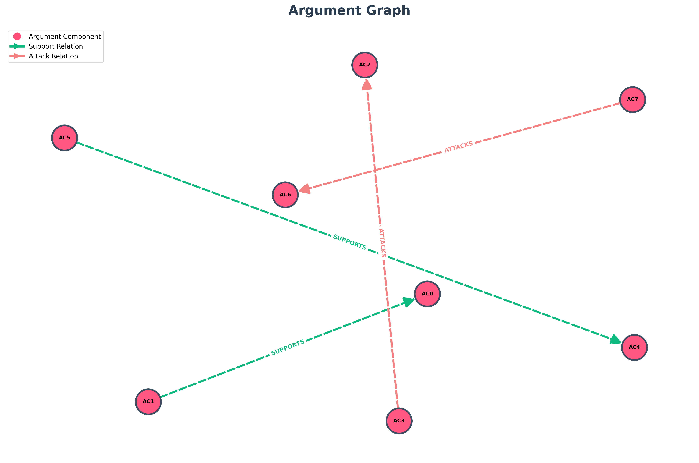

# TESTO
Kamala Harris the Former Vice President of the United States (2021–2025). A lawyer and public official who favors thoughtful regulation, civil-rights safeguards, and human-centered approaches to technology. Donald Trump, the President of the United States (as of 2025). A businessman-turned-politician who emphasizes rapid economic leadership, competitiveness, and minimizing regulation to spur innovation.
Kamala Harris: "AI promises great benefits, but we must set clear rules so safety, privacy, and fairness aren't afterthoughts. Government has a role to protect workers and prevent bias."
Donald Trump: "We should lead the world in AI — cut red tape, fund research, and let American companies move fast. Over-regulation will send talent overseas and kill jobs."
Kamala Harris: "Leadership means both promoting innovation and ensuring accountability. Standards, audits, and support for displaced workers are not brakes — they're insurance for long-term success."
Donald Trump: "Agreed on leadership — but the priority must be winning the AI race. Smart incentives and public-private partnerships will keep America first without strangling growth."

## Topic: "AI Regulation and Innovation"

# Entità:
+ Kamala Harris
+ Donald Trump

# Knowledge Base Entità finale
[('Kamala Harris',
  'position',
  'Former Vice President of the United States (2021–2025)'),
 
 ('Donald Trump', 'position', 'President of the United States (as of 2025)'),
 
 ('Donald Trump',
  'side_information',
  'views_on_economic_policy;emphasizes rapid economic leadership, competitiveness, and minimizing regulation to spur innovation'),
 
 ('Kamala Harris',
  'side_information',
  'views_on_policy;favors thoughtful regulation, civil-rights safeguards, and human-centered approaches to technology')]

# Componenti Argumentative
- 'AC0': "we must set clear rules so safety, privacy, and fairness aren't afterthoughts",
- 'AC1': 'Government has a role to protect workers and prevent bias',
- AC2': 'We should lead the world in AI — cut red tape, fund research, and let American companies move fast',
- 'AC3': 'Over-regulation will send talent overseas and kill jobs',
- 'AC4': 'Leadership means both promoting innovation and ensuring accountability',
- 'AC5': "Standards, audits, and support for displaced workers are not brakes — they're insurance for long-term success",
- 'AC6': 'the priority must be winning the AI race',
- 'AC7': 'Smart incentives and public-private partnerships will keep America first without strangling growth'

# Attacchi e Supporti
[('AC5', 'SUPPORTS', 'AC4'),
 
 ('AC1', 'SUPPORTS', 'AC0'),
 
 ('AC3', 'ATTACKS', 'AC2'),
 
 ('AC7', 'ATTACKS', 'AC6')]

# Score

| Componente | Testo | Autore | Score con side_information |Score senza side_information|Via prompt|
| :---: | :--- | :--- | :---: | :---: | :---:|
| **AC0** | we must set clear rules so safety, privacy, and fairness aren't afterthoughts | Kamala Harris | $0.573080$ | $0.617784$|$0.95$|
| **AC1** | Government has a role to protect workers and prevent bias | Donald Trump | $0.486511$ |$0.465803$ | $0.5$|
| **AC2** | We should lead the world in AI — cut red tape, fund research, and let American companies move fast | Donald Trump | $0.672655$ |$0.711005$|$0.85$|
| **AC3** | Over-regulation will send talent overseas and kill jobs | Donald Trump | $0.362432$ | $0.353480$| $0.95$|
| **AC4** | Leadership means both promoting innovation and ensuring accountability | Kamala Harris | $0.627782$ |$0.740219$ |$0.95$|
| **AC5** | Standards, audits, and support for displaced workers are not brakes — they're insurance for long-term success | Kamala Harris | $0.300877$ | $0.346050$ |$0.95$|
| **AC6** | the priority must be winning the AI race | Donald Trump | $0.502186$* | $0.294938$| $0.95$|
| **AC7** | Smart incentives and public-private partnerships will keep America first without strangling growth | Donald Trump | $0.478966$ | $0.455422$ |$0.85$|

*Credo si abbia questo dislivello tra i due score, in quanto nel side information vi è presente:

 ('Donald Trump',
  'side_information',
  'views_on_economic_policy;emphasizes rapid economic leadership, competitiveness, and minimizing regulation to spur innovation'),
 

