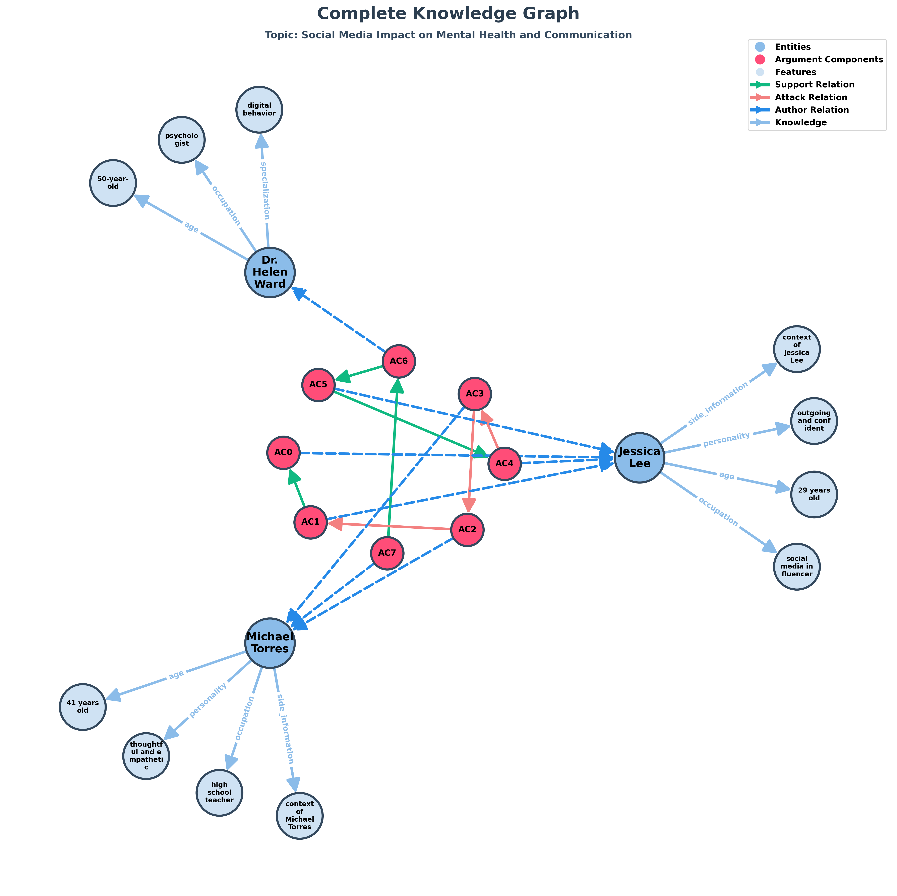
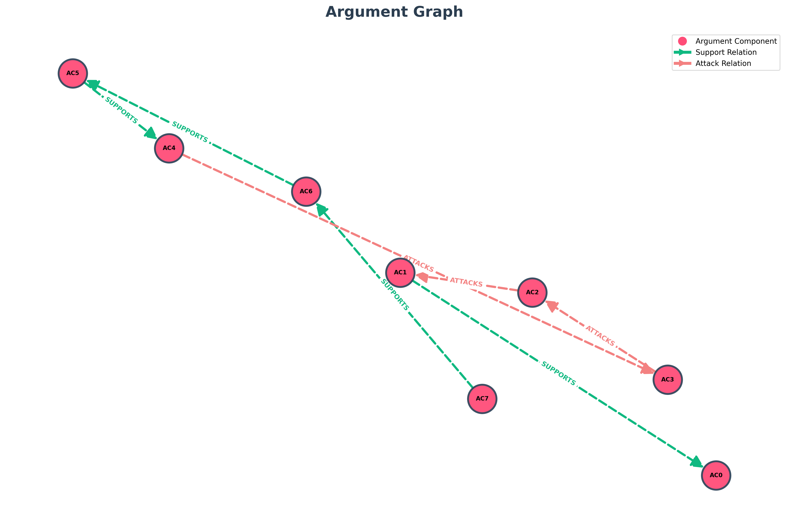

# TESTO
Jessica Lee, a 29-year-old social media influencer with over a million followers. She believes online platforms can empower people, build communities, and give everyone a voice. Outgoing and confident, she sees social media as a tool for connection and creativity. Michael Torres, a 41-year-old high school teacher who has seen his students struggle with anxiety, self-esteem issues, and distraction due to social media use. Thoughtful and empathetic, he worries that online life damages real-world relationships. Dr. Helen Ward, a 50-year-old psychologist specializing in digital behavior. She researches how constant connectivity affects emotional well-being. Balanced and analytical, she tries to find a middle ground between freedom of expression and mental health concerns. Helen: "Social media has reshaped how we communicate, but it’s also linked to rising anxiety and loneliness. What’s your view?" Jessica: "I understand the concerns, but social media gives people a platform to express themselves. It can inspire and connect millions." Michael: "Maybe, but I see students comparing themselves to unrealistic images every day. It’s harming their confidence and focus." Jessica: "That’s why education is key. We should teach people how to use social media responsibly, not demonize it." Helen: "I agree. The solution isn’t abandoning technology but understanding its effects and setting healthy boundaries." Michael: "True, but the companies themselves need to take responsibility for how their platforms influence behavior." Jessica: "Absolutely — balance and awareness are what we all need."

## Topic: "Social Media Impact on Mental Health and Communication"

# Entità:
+ Jessica Lee
+ Michael Torres
+ Dr. Helen Ward

# Knowledge Base Entità finale
[('Jessica Lee', 'occupation', 'social media influencer'),
 
 ('Jessica Lee', 'age', '29 years old'),
 
 ('Michael Torres', 'age', '41 years old'),
 
 ('Jessica Lee', 'personality', 'outgoing and confident'),
 
 ('Dr. Helen Ward', 'specialization', 'digital behavior'),
 
 ('Michael Torres', 'personality', 'thoughtful and empathetic'),
 
 ('Dr. Helen Ward', 'occupation', 'psychologist'),
 
 ('Michael Torres', 'occupation', 'high school teacher'),
 
 ('Dr. Helen Ward', 'age', '50-year-old'),
 
 ('Michael Torres',
  'side_information',
  'worry online life damages real-world relationships; concerns students struggling with anxiety, self-esteem issues, and distraction due to social media use'),
 
 ('Jessica Lee', 'side_information', 'followers over a million')]

 # Componenti Argumentative
- 'AC0': 'social media gives people a platform to express themselves',
- 'AC1': 'It can inspire and connect millions',
- 'AC2': 'I see students comparing themselves to unrealistic images every day',
- 'AC3': 'It’s harming their confidence and focus',
- 'AC4': 'education is key',
- 'AC5': 'We should teach people how to use social media responsibly, not demonize it',
- 'AC6': 'The solution isn’t abandoning technology but understanding its effects and setting healthy boundaries',
- 'AC7': 'the companies themselves need to take responsibility for how their platforms influence behavior'

# Attacchi e Supporti
[('AC5', 'SUPPORTS', 'AC4'),
 
 ('AC4', 'ATTACKS', 'AC3'),
 
 ('AC3', 'ATTACKS', 'AC2'),
 
 ('AC2', 'ATTACKS', 'AC1'),
 
 ('AC1', 'SUPPORTS', 'AC0'),
 
 ('AC7', 'SUPPORTS', 'AC6'),
 
 ('AC6', 'SUPPORTS', 'AC5')]

 # Score

| Componente | Testo | Autore | Score con side_information |Score senza side_information|Via prompt|
| :---: | :--- | :--- | :---: | :---: | :---:|
| **AC0** | social media gives people a platform to express themselves | Jessica Lee | $0.896544$ | $0.911196$|$0.95$|
| **AC1** | It can inspire and connect millions** | Jessica Lee | $0.137180$ |$0.147521$ | $0.95$|
| **AC2** | I see students comparing themselves to unrealistic images every day | Michael Torres | $0.672655$ |$0.387184$|$0.95$|
| **AC3** | It’s harming their confidence and focus | Michael Torres | $0.156708$* | $0.040551$* | $0.95$|
| **AC4** | education is key | Jessica Lee | $0.879985$ |$0.902882$ |$0.85$|
| **AC5** | We should teach people how to use social media responsibly, not demonize it | Jessica Lee | $0.879985$ | $0.810956$ |$0.85$|
| **AC6** | The solution isn’t abandoning technology but understanding its effects and setting healthy boundaries | Dr. Helen Ward' | $0.370047$ | $0.430456$| $0.95$|
| **AC7** | the companies themselves need to take responsibility for how their platforms influence behavior | Michael Torres | $0.381952$ | $0.411665$ |$0.85$|

*Dovrebbe essere più alto visto che Micheal è un insegnante.

**Dovrebbe essere più alto visto che Jessica è un influencer.

---

